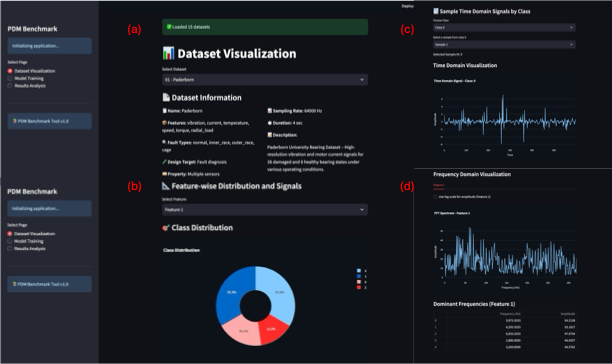
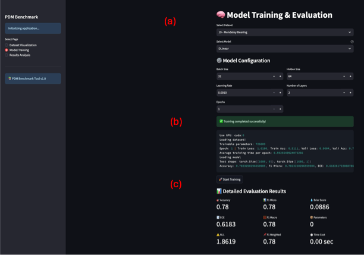
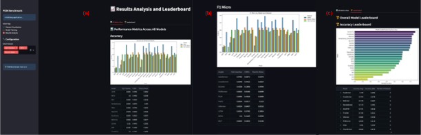

# PDMBench

A Standardized and Multi-Perspective Benchmark for Predictive Maintenance on Multi-Sensor Industrial Time-Series Data 

## Getting Started

### 1. Install Requirements

We recommend Python 3.8+ and a virtual environment. Then run:

```bash
pip install -r requirements.txt
```

### 2. Prepare Datasets

Download and unzip the datasets into the `./dataset/` directory. We support all standard datasets defined in the benchmark, including:

* Paderborn, CWRU, FEMTO, IMS, MFPT, XJTU, HUST Bearing, etc. 

Our dataset can be downloaded from https://huggingface.co/collections/odysseywt/pdmlibrary-682504064fc74fcd889cc17f

See the `dataset_mapping` inside the codebase for full descriptions.

### 3. Run Benchmark Experiments

To train and evaluate a model via CLI:

```bash
python run.py --task_name classification --model TimesNet --data 01 --is_training 1
```

Modify `--model`, `--data`, and other hyperparameters as needed. All models listed in TSLib (e.g., `TimeMixer`, `iTransformer`, `PatchTST`, `Koopa`, etc.) are supported.

### 5. Use the Streamlit App (Interactive GUI)

To launch the interactive web application:

```bash
streamlit run app.py
```

This interface allows you to:

* Browse and visualize time-domain and frequency-domain characteristics of PdM datasets
* Select, configure, and train SOTA models interactively
* View and compare model performance across datasets via dynamic leaderboards
* Monitor training progress and visualize metrics in real time

## Features

### Dataset Visualization

*Figure 1: Dataset selection and time-/frequency-domain feature visualization.*

### Model Training

*Figure 2: Model configuration, training progress, and real-time performance feedback.*

### Result Analysis & Leaderboard

*Figure 3: Cross-dataset performance analysis and leaderboard comparison of models.*

## Description

As shown in **Figure 1**, users can interactively explore raw time-series signals along with their frequency-domain representations to understand sensor characteristics and class distributions.

**Figure 2** demonstrates the model training module, where users can configure model parameters and monitor training and validation metrics in real time.

Finally, **Figure 3** presents the benchmarking interface, where metrics such as accuracy, F1 score, calibration error, and inference time are summarized across datasets. This helps practitioners select and tune models based on task-specific requirements.


